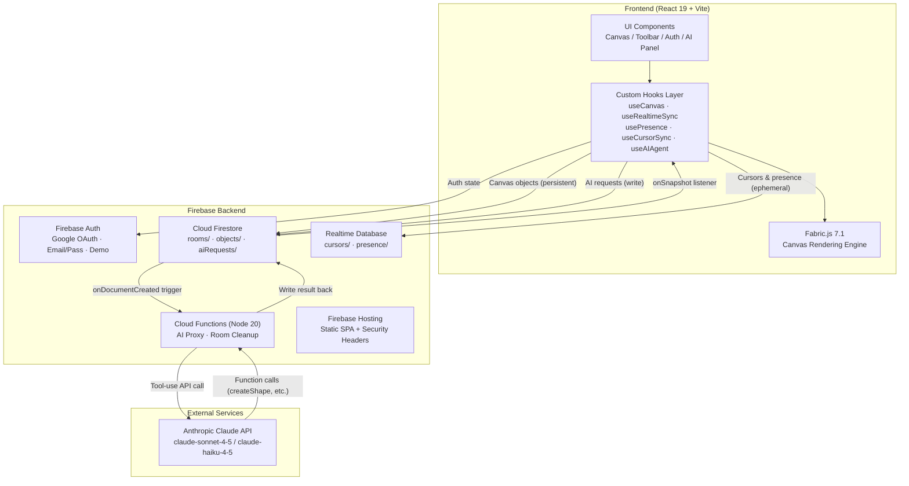
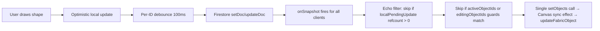
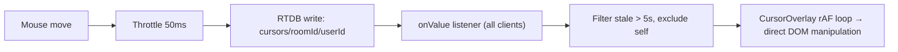

# Architecture Design Record — Collaborative Canvas

A top-down technical walkthrough of the dual-mode real-time collaborative whiteboard.

---

## 1. System Overview

### High-Level System Flow



### Real-Time Object Sync Flow



### Cursor Sync Flow



---

## 2. Tech Stack

| Layer | Technology | Version |
|---|---|---|
| Framework | React + TypeScript | 19.2 / 5.9 |
| Build | Vite | 7.2 |
| Styling | Tailwind CSS | 4.1 |
| Canvas | Fabric.js | 7.1 |
| Backend | Firebase (Auth, Firestore, RTDB, Functions, Hosting) | 12.8 |
| AI (Primary) | Anthropic Claude API (via Cloud Functions) | claude-sonnet-4-5 / claude-haiku-4-5 |
| AI (Alt) | Google Generative AI (Gemini) | 0.24 |
| Routing | React Router DOM | 7.13 |
| IDs | uuid | 13.0 |
| Testing | Vitest | 3.2 |
| Linting | ESLint + TypeScript ESLint | 9.39 / 8.46 |
| Observability | LangSmith (Cloud Function tracing) | — |

---

## 3. Project Structure

```
collaborative-canvas/
├── src/
│   ├── main.tsx                          # React DOM entry point
│   ├── App.tsx                           # Router, AuthProvider, route guards
│   ├── index.css                         # Tailwind imports + global styles
│   │
│   ├── types/
│   │   ├── canvas.ts                     # CanvasObject, ShapeType, Tool, Room, CursorState
│   │   ├── user.ts                       # User, PresenceData
│   │   ├── ai.ts                         # AITool, AIMessage, AICommandResult
│   │   └── index.ts                      # Re-exports
│   │
│   ├── utils/
│   │   ├── colors.ts                     # USER_COLORS palette, SHAPE_COLORS, color selection
│   │   ├── throttle.ts                   # throttle() and debounce() with flush()
│   │   ├── zIndex.ts                     # computeNewZIndex, computeBatchZIndex utilities
│   │   ├── canvasPosition.ts            # getTopLeftPosition, getAbsolutePosition helpers
│   │   ├── index.ts                      # Re-exports
│   │   ├── colors.test.ts               # Color utility tests
│   │   ├── throttle.test.ts             # Throttle/debounce tests
│   │   ├── zIndex.test.ts               # Z-index utility tests
│   │   └── canvasPosition.test.ts       # Position utility tests
│   │
│   ├── services/
│   │   ├── firebase.ts                   # Firebase app init, config, isFirebaseConfigured flag
│   │   ├── canvasSync.ts                 # Firestore CRUD: syncObject, syncObjectPartial, batchSyncObjectsPartial, subscribeToObjects
│   │   ├── cursorSync.ts                 # RTDB cursor position syncing: updateCursor, subscribeToCursors
│   │   ├── presenceSync.ts              # RTDB presence: setUserOnline, heartbeatPresence, subscribeToPresence
│   │   ├── aiService.ts                  # AI_TOOLS definitions, executeAIAction, local NLP parser
│   │   ├── geminiService.ts              # Anthropic direct API + Cloud Function client, processGeminiCommand
│   │   ├── templateRegistry.ts           # 10 pre-built templates: SWOT, flowchart, kanban, bar chart, etc.
│   │   ├── aiService.test.ts            # AI action execution tests
│   │   └── index.ts                      # Re-exports
│   │
│   ├── hooks/
│   │   ├── useAuth.tsx                   # AuthContext provider, auth state management
│   │   ├── useCanvas.ts                  # Fabric.js initialization, zoom, pan, grid, object:modified normalization
│   │   ├── useRealtimeSync.ts           # Canvas object sync: batched snapshots, writeBatch, per-ID debounce
│   │   ├── usePresence.ts               # Online user tracking: .info/connected, heartbeat, stale filter
│   │   ├── useCursorSync.ts             # Cursor broadcasting: 50ms throttle, selection + motion state
│   │   ├── useAIAgent.ts                # AI command pipeline: local parser → Anthropic/Cloud Function
│   │   ├── useKeyboardShortcuts.ts      # Ctrl+Z/Y, Delete, ]/[, Ctrl+C/V bindings
│   │   └── index.ts                      # Re-exports
│   │
│   ├── components/
│   │   ├── Auth/
│   │   │   ├── LoginForm.tsx            # Email/password, Google, demo login UI
│   │   │   ├── UserAvatar.tsx           # User avatar with initials/photo + color
│   │   │   └── index.ts
│   │   ├── Canvas/
│   │   │   ├── Canvas.tsx               # Core drawing engine (~2300 lines)
│   │   │   ├── CanvasToolbar.tsx        # Tool buttons, color pickers, zoom controls
│   │   │   ├── CursorOverlay.tsx        # Remote cursor rendering with rAF DOM manipulation
│   │   │   └── index.ts
│   │   ├── Presence/
│   │   │   ├── OnlineUsers.tsx          # Online user list with editing status
│   │   │   └── index.ts
│   │   ├── AI/
│   │   │   ├── AICommandInput.tsx       # Floating AI chat panel + input
│   │   │   └── index.ts
│   │   └── Layout/
│   │       ├── Home.tsx                 # Room lobby: create/join interface
│   │       ├── Room.tsx                 # Workspace orchestrator: wires hooks → Canvas
│   │       └── index.ts
│   │
│   ├── test/
│   │   └── setup.ts                     # Test environment setup
│   │
│   └── assets/
│       └── react.svg
│
├── functions/                            # Cloud Functions backend
│   └── src/
│       └── index.ts                     # aiProxy + onRoomDeleted functions
│
├── Configuration:
│   ├── vite.config.ts                   # Vite build (React plugin, Tailwind, Vitest, esbuild pure)
│   ├── tsconfig.app.json               # TS strict mode, ES2022 target
│   ├── eslint.config.js                # ESLint + React hooks rules
│   ├── firebase.json                   # Firestore, RTDB, Functions, Hosting config
│   ├── firestore.rules                 # Firestore security rules
│   ├── database.rules.json            # Realtime Database security rules
│   ├── firestore.indexes.json         # Firestore index definitions
│   └── .env.local                      # Firebase credentials (not committed)
```

---

## 4. Entry Point → Routing → Room Orchestrator

### App.tsx — Routing & Auth Guard

`App.tsx` sets up `BrowserRouter` → `AuthProvider` → route table:

```
/login         → LoginForm (public, redirects to / if authenticated)
/              → Home (protected) — room lobby
/room/:roomId  → Room (protected) — canvas workspace
*              → redirect to /
```

`ProtectedRoute` checks `useAuth().user` — redirects to `/login` if null. `RoomPage` extracts `:roomId` from the URL and passes it to `Room`.

### Room.tsx — The Orchestrator Hub

`Room.tsx` (~370 lines) is where all hooks meet the UI. It instantiates four real-time hooks, wires their outputs into Canvas via callback props, and manages cross-cutting concerns like AI history batching.

**Hooks instantiated in Room:**

| Hook | Service Layer | Backend | What Room Gets |
|------|--------------|---------|----------------|
| `useCursorSync` | `cursorSync.ts` | RTDB | `remoteCursors`, `broadcastCursor` |
| `usePresence` | `presenceSync.ts` | RTDB | `onlineUsers`, `isConnected` |
| `useRealtimeSync` | `canvasSync.ts` | Firestore | `objects` (Map), CRUD functions, `setEditingObjectId`, `setActiveObjectIds` |
| `useAIAgent` | `aiService.ts` + `geminiService.ts` | Anthropic API / Cloud Function | `messages`, `isProcessing`, `processCommand` |

**The callback-prop pattern:**

Canvas emits events → Room forwards to hooks. Room defines handler callbacks (e.g., `handleObjectCreated`, `handleObjectModified`, `handleCursorMove`) that delegate to the appropriate hook function. Canvas never imports hooks directly — it receives everything via props.

Key callback registrations that Canvas pushes **up** to Room:
- `onHistoryAddChange` — Canvas exposes its `addToHistory` function so Room can add entries during AI operations (`Room.tsx:342`)
- `onSelectObjectsReady` — Canvas exposes a `selectObjects` function so Room can auto-select AI-created objects (`Room.tsx:345`)
- `onViewportCenterChange` — Canvas exposes `getCanvasCenter` so Room can pass viewport position to AI (`Room.tsx:341`)
- `onActiveObjectsChange` — Canvas reports which objects are selected so `useRealtimeSync` can guard them from remote overwrites (`Room.tsx:346`)

**Ref-forwarding pattern:**

Room stores Canvas-provided functions in refs (`addToHistoryRef`, `selectObjectsFnRef`) because they're needed inside callbacks that would otherwise create stale closures.

**AI history batching:**

Room wraps AI operations in `startHistoryBatch()` / `endHistoryBatch()`. During a batch, all `addHistoryEntry` calls are collected in `batchEntriesRef` instead of pushed to the undo stack. When the batch ends, they're committed as a single `{ type: 'batch', batchEntries: [...] }` entry, making Ctrl+Z undo all AI-created objects at once (`Room.tsx:112-140`).

**React Profiler:**

Room wraps `<Canvas>` in a `<Profiler>` that warns when render duration exceeds 16ms (`Room.tsx:327-329`).

---

## 5. State Architecture

### Hooks-per-Domain

Each custom hook owns one domain of state. Room.tsx wires them together.

| State Domain | Storage | Location |
|---|---|---|
| Auth | React Context | `useAuth()` context provider |
| Canvas Objects | `Map<id, CanvasObject>` | `useRealtimeSync()` state |
| Fabric.js Instance | `useRef<Canvas>` | `useCanvas()` hook ref |
| Cursor Positions | `Map<userId, CursorState>` | `useCursorSync()` state |
| Presence (online users) | `PresenceData[]` | `usePresence()` state |
| Undo/Redo History | `useRef<HistoryEntry[]>` | `Canvas.tsx` component ref |
| AI Messages | `AIMessage[]` | `useAIAgent()` state |
| UI State (tools, colors, zoom) | Local state | `useCanvas()` state |
| Active Object IDs | `useRef<Set<string>>` | `useRealtimeSync()` ref (LWW guard) |
| Editing Object IDs | `useRef<Set<string>>` | `useRealtimeSync()` ref (optimistic lock) |
| Clipboard | `useRef<{type, props}[]>` | `Canvas.tsx` component ref |

### Key Refs and Their Purposes

| Ref | Location | Purpose |
|-----|----------|---------|
| `fabricRef` | `useCanvas` | Stable reference to the Fabric.js Canvas instance |
| `localPendingUpdates` | `useRealtimeSync` | Refcount per object ID — incoming snapshots decrement; when 0, echo is consumed |
| `activeObjectIds` | `useRealtimeSync` | IDs the local user is selecting — remote updates for these are silently dropped |
| `editingObjectIds` | `useRealtimeSync` | IDs being text-edited — remote updates blocked, 2s grace period on blur |
| `objectStateBeforeModifyRef` | `Canvas.tsx` | Captures props at `mouse:down` so `object:modified` can compute the diff for undo |
| `textBufferRef` | `Canvas.tsx` | Maps object ID → latest typed text; survives Fabric object recreation during sync |
| `editingTextboxRef` | `Canvas.tsx` | Tracks the active Textbox during editing (Fabric's `getActiveObject()` is null in exit event) |
| `pendingDeletionRef` | `Canvas.tsx` | Object IDs pending undo-delete — prevents sync from re-creating them |
| `rtdbControlledRef` | `Canvas.tsx` | Object IDs whose positions are streamed via RTDB — skip Firestore reconciliation |
| `zIndexSignatureRef` | `Canvas.tsx` | Stable string signature of all zIndex values — prevents redundant restack |
| `addToHistoryRef` | `Room.tsx` | Stores Canvas's `addToHistory` function for use in AI callbacks |
| `selectObjectsFnRef` | `Room.tsx` | Stores Canvas's `selectObjects` function for AI auto-selection |
| `remoteSyncTimers` | `useRealtimeSync` | Per-ID debounce timers for Firebase writes (100ms) |
| `remoteSyncPending` | `useRealtimeSync` | Latest props waiting to be flushed per object ID |

### Why No Redux/Zustand

The domains are **naturally isolated** — cursor state never reads auth, presence never reads canvas objects. Firebase listeners already act as the "single source of truth." Adding a client-side store would create a **dual-source-of-truth problem** where Firestore and Redux must stay in sync. The app has ~6 state domains with clear ownership; Redux becomes justified at ~15+ domains with heavy cross-domain reads.

**Trade-off:** `Room.tsx` becomes a wiring hub (~370 lines of prop-passing). If the number of hooks doubled, this orchestrator would become unwieldy and a state library would become justified.

---

## 6. Feature Walkthroughs

### a. Drawing a Shape

Full path from mouse click to remote display:

1. **Mouse event** → User selects a shape tool (e.g., `rect`) from `CanvasToolbar.tsx`.
   `Canvas.tsx` sets `tool` state, which triggers a `useEffect` that sets `canvas.defaultCursor = 'crosshair'` and `canvas.selection = false` (`Canvas.tsx:253-297`).

2. **mousedown** → `Canvas.tsx:1426-1583` shape drawing effect fires. Creates a temporary Fabric object at the pointer position with `uuidv4()` ID. Adds it to canvas immediately.

3. **mousemove** → `Canvas.tsx:1585-1732` resizes the shape via drag (width/height for rects, radius for circles). Fabric renders each frame.

4. **mouseup** → `Canvas.tsx:1734-1910` finalizes:
   - Validates minimum 5px size (sticky/textbox always valid)
   - Normalizes origin to top-left via manual coordinate math
   - Increments `objectCountRef` for zIndex
   - Calls `onObjectCreated(id, type, props, zIndex)` → Room
   - Calls `addToHistory({ type: 'create', ... })` for undo
   - Auto-selects the new shape, switches tool to `'select'`

5. **Room** → `handleObjectCreated` → `useRealtimeSync.createObject()` (`useRealtimeSync.ts:236-287`):
   - **Optimistic:** Sets local `objects` Map immediately via `setObjects`
   - **Async:** Calls `canvasSync.syncObject()` → Firestore `setDoc({ merge: true })`
   - **Echo prevention:** Increments `localPendingUpdates` refcount for this ID

6. **Remote users** → `subscribeToObjects()` (`canvasSync.ts:180-205`) fires a batched callback with `{ added, modified, removed }` arrays. `useRealtimeSync` processes these in a single `setObjects` call (`useRealtimeSync.ts:163-218`). The Canvas sync effect (`Canvas.tsx:1958-2089`) iterates `remoteObjects`, calls `createFabricObject()` for new IDs, adds them to the Fabric canvas, and calls `canvas.renderAll()`.

### b. Real-Time Object Sync

**Batched snapshot handling:**

`subscribeToObjects` (`canvasSync.ts:180-205`) attaches a single `onSnapshot` listener ordered by `zIndex`. Each snapshot fires a single callback with categorized `docChanges()` — `added`, `modified`, `removed`. The `useRealtimeSync` handler processes all three in one `setObjects` call, producing exactly one React state update per Firestore snapshot (`useRealtimeSync.ts:163-218`).

A perf counter (`setObjectsCallCount`) tracks frequency and logs a `[Perf]` warning when `setObjects` is called more than once per second (`useRealtimeSync.ts:44-54`).

**Echo prevention:**

`localPendingUpdates` is a `Map<string, number>` (refcount per object ID). When the local user writes to Firestore, the refcount is incremented. When `onSnapshot` delivers the echo back, the `modified` handler decrements the refcount and skips the update while count > 0 (`useRealtimeSync.ts:181-191`).

**Conflict resolution — three layers:**

1. **Firestore LWW:** `setDoc({ merge: true })` and `updateDoc` with dot-notation (`props.left`, `props.top`) mean the most recent write wins per field.

2. **activeObjectIds guard** (React state layer): Objects the local user has selected are tracked in `activeObjectIds` ref. Incoming `modified` snapshots for these IDs are silently dropped (except zIndex changes, which still sync). This prevents remote updates from fighting the local user's drag (`useRealtimeSync.ts:196-203`).

3. **Canvas layer guard:** The Canvas sync effect (`Canvas.tsx:2000-2020`) additionally skips visual updates for any object that is the `getActiveObject()` or inside an `ActiveSelection`, unless angle/scale programmatically differs.

**Per-ID debounce for updateObject:**

Local state is updated immediately (no debounce). Only the remote Firestore write is debounced at 100ms per object ID via `remoteSyncTimers` / `remoteSyncPending` refs. This ensures batch updates (e.g., ActiveSelection children each getting their own `updateObject` call) all get local state immediately while coalescing their network writes (`useRealtimeSync.ts:342-403`).

**WriteBatch for multi-object operations:**

- `createObjects` (paste): Builds a `writeBatch` with all objects and commits once (`useRealtimeSync.ts:290-340`).
- `batchUpdateObjects` (ActiveSelection move): Single `batchSyncObjectsPartial` → `writeBatch` for atomic snapshot delivery (`useRealtimeSync.ts:408-458`).
- `clearAllObjects`: `writeBatch.delete` for all objects in one commit (`useRealtimeSync.ts:489-511`).

### c. Multi-Select & ActiveSelection

1. **Selection events** → User rubber-band selects multiple objects or Ctrl+clicks. Fabric.js creates an `ActiveSelection` group.

2. **object:modified on ActiveSelection** → `Canvas.tsx:927-1005` post-processes each child:
   - `postProcess()` computes effective scale via `child.calcTransformMatrix()` → flattens group scale into actual dimensions (`width * effScaleX`)
   - Handles sticky note height preservation (`_stickyHeight`)
   - Creates a `batchEntries` array of `HistoryEntry` (type: `'modify'`) for each changed child
   - Wraps as `{ type: 'batch', objectId: 'multi-select', batchEntries }` for single-undo

3. **Batch sync** → `onObjectsBatchModified` → `batchUpdateObjects` → `batchSyncObjectsPartial` → single Firestore `WriteBatch` → atomic snapshot delivery on remote clients (`canvasSync.ts:112-136`).

### d. Text Editing Lifecycle

1. **Enter editing** → `text:editing:entered` event → `Canvas.tsx:1048-1055`:
   - Stores `{ id, obj }` in `editingTextboxRef` (because `getActiveObject()` is null during exit)
   - Calls `onEditingObjectChange(id)` → `useRealtimeSync.setEditingObjectId(id)` → adds to `editingObjectIds` set

2. **Buffer keystrokes** → `text:changed` event → `Canvas.tsx:1059-1063`:
   - Writes current text to `textBufferRef.current.set(id, text)` — no remote sync during typing

3. **Exit editing** → `text:editing:exited` event → `Canvas.tsx:1069-1082`:
   - Reads final text from the Fabric Textbox (not the event) via `getObjectProps(editing.obj)`
   - Calls `onObjectModified(id, props)` → triggers remote sync
   - Calls `onFlushSync()` → immediately fires pending debounced writes
   - Clears `textBufferRef` entry
   - Calls `onEditingObjectChange(null)` → 2-second grace period

4. **2-second grace period** → `useRealtimeSync.ts:612-627`:
   - When editing ends, the lock isn't cleared immediately. A `setTimeout(2000)` keeps the `editingObjectIds` entry active to absorb late-arriving Firestore echoes that would otherwise overwrite the just-saved text.

5. **Text buffer persistence** → During remote object sync (`Canvas.tsx:2026-2031`), if a `textBufferRef` entry exists for an object being updated, the buffered text is preserved instead of the remote text. This prevents sync from replacing text the user is actively typing.

### e. Cursor Broadcasting

1. **Mouse move** → `Canvas.tsx:1095-1110` fires `onCursorMove(scenePoint.x, scenePoint.y)` on every `mouse:move` event.

2. **Room** → `handleCursorMove` → `useCursorSync.broadcastCursor()` (`useCursorSync.ts:172-204`):
   - Position-only changes are throttled to 50ms via `throttledPositionUpdate`
   - Selection changes (`selectedObjectIds`) and motion state (`isMoving`) are sent immediately
   - During active drag, all updates send immediately (no throttle) to minimize remote latency
   - A 2-second heartbeat keeps cursor alive even when idle (`useCursorSync.ts:152-160`)

3. **RTDB write** → `cursorSync.updateCursor()` (`cursorSync.ts:25-34`) does fire-and-forget `set()` to `cursors/{roomId}/{userId}`.

4. **Remote subscription** → `subscribeToCursors()` (`cursorSync.ts:55-83`) listens via `onValue` on `cursors/{roomId}`, filters out self and stale cursors (>5s), returns a `Map<userId, CursorState>`.

5. **CursorOverlay rendering** → `CursorOverlay.tsx:27-62` runs a continuous `requestAnimationFrame` loop:
   - Reads `cursorsRef.current` (synced via `useEffect`, no re-render needed)
   - Transforms world coordinates to screen coordinates using `canvas.viewportTransform` and `zoom`
   - Updates `el.style.transform = translate(...)` directly (no React state, no re-render)
   - Skips updates when position delta < 0.5px

6. **Selection + motion broadcasting** → `Canvas.tsx:1112-1253`:
   - `selection:created` / `selection:updated` → broadcasts selected object IDs
   - `object:moving` / `object:scaling` / `object:rotating` → broadcasts `isMoving=true` + `movingObjectPositions` (per-object positions extracted from ActiveSelection via `getAbsolutePosition`)
   - `object:modified` / `mouse:up` → broadcasts `isMoving=false`
   - Remote clients apply RTDB-streamed positions directly to Fabric objects (`Canvas.tsx:1912-1956`), bypassing Firestore for real-time drag preview

### f. Presence System

**Firebase mode** (`usePresence.ts:112-167`):

1. **Subscribe first** → `subscribeToPresence()` (`presenceSync.ts:89-116`) listens via `onValue` on `presence/{roomId}`, filters by `online === true` AND `lastSeen` within 8-second stale threshold.

2. **Detect connection** → `.info/connected` ref fires `onValue` callback when RTDB connects/reconnects. On connect:
   - `setUserOnline()` (`presenceSync.ts:35-60`): **await** `onDisconnect().set({ online: false })` first (ensures server-side cleanup is registered before announcing), then `set({ online: true, lastSeen: serverTimestamp() })`.

3. **Heartbeat** → Every 3 seconds, `heartbeatPresence()` updates only `lastSeen` via `update()` (`presenceSync.ts:63-69`).

4. **Reconnect handling** → When the browser tab becomes visible, `visibilitychange` event re-calls `setUserOnline()` to recover from background tab throttling.

5. **Cleanup** → Effect cleanup only tears down listeners and heartbeat interval. **Does NOT call `setUserOffline`** — relies entirely on Firebase's `onDisconnect()` server-side handler.

**Demo mode** (`usePresence.ts:32-106`):

BroadcastChannel `canvas-presence-{roomId}` with heartbeat every 3s, 6-second stale timeout, request/response sync for tab discovery.

### g. AI Command Processing

**Three-tier execution pipeline** (`useAIAgent.ts:43-124`):

1. **Local parser** (`tryLocalCommand` in `useAIAgent.ts:343-385`):
   - `canHandleLocally()` checks if the command matches local patterns (simple shapes, templates, arrange, rotate, resize, delete, grid, textbox, sticky)
   - Excludes composition nouns (dog, house, person) — those need cloud AI
   - Supports multi-step commands via `and then` / `then` / `;` splitting
   - Returns instantly with no network call

2. **Template registry** (`templateRegistry.ts`):
   - 10 pre-built templates: SWOT, bar chart, flowchart, org chart, kanban, mind map, timeline, pros & cons, 2x2 matrix, mobile wireframe
   - `findTemplate()` keyword-matches against the command
   - `executeTemplate()` either uses declarative `elements` array (offset-based) or a `build()` function (for complex layouts like bar chart)

3. **Cloud AI** (`geminiService.ts:529-641`):
   - **Tier 1 — Direct Anthropic API** (dev only, `VITE_ANTHROPIC_API_KEY` set):
     - `classifyComplexity()`: composition nouns → `complex`, everything else → `simple`
     - Simple: `claude-haiku-4-5` with `tool_choice: { type: 'any' }`, 4096 max tokens
     - Complex: `claude-sonnet-4-5` with `thinking: { type: 'enabled', budget_tokens: 3000 }`, 12000 max tokens
     - Calls via Vite dev proxy (`/api/anthropic/v1/messages`)
   - **Tier 2 — Firebase Cloud Function** (production):
     - Writes `aiRequest` document to `rooms/{roomId}/aiRequests/`
     - Subscribes to `onSnapshot` on the document
     - **Progressive rendering**: As `partialFunctionCalls` appear (written by streaming in the Cloud Function), the client executes them immediately — shapes appear on canvas while the AI is still generating
     - 120-second client timeout

4. **Tool execution** → `executeAIAction()` (`aiService.ts`) maps tool names to canvas mutations: `createShape`, `moveObject`, `resizeObject`, `rotateObject`, `updateObject`, `deleteObject`, `arrangeObjects`, `createLoginForm`, `createNavigationBar`, `duplicateObject`, `reorderObject`.

**History batching for AI:**

Room calls `startHistoryBatch()` before processing → all `addHistoryEntry()` calls during the batch are collected in `batchEntriesRef` → `endHistoryBatch()` commits them as a single `{ type: 'batch' }` entry → Ctrl+Z undoes all created objects at once. After batch ends, AI-created object IDs are auto-selected via `selectObjectsFnRef` (`Room.tsx:112-140`).

### h. Undo/Redo System

**Data structure** (`Canvas.tsx:14-23`):

```typescript
HistoryEntry =
  | { type: 'create',  objectId, objectType, props, zIndex }
  | { type: 'delete',  objectId, objectType, props, zIndex }
  | { type: 'modify',  objectId, previousProps, newProps }
  | { type: 'batch',   objectId, batchEntries: HistoryEntry[] }
```

**Stack management** (`Canvas.tsx:186-198`):
- Ref-based stack (`historyRef`), max 50 entries (FIFO eviction)
- Separate `redoHistoryRef` — cleared on any new action
- `canUndo` / `canRedo` state drives toolbar button disabled state

**Undo logic** (`Canvas.tsx:366-528`):

| Entry Type | Undo Action |
|---|---|
| `create` | Remove from canvas, mark in `pendingDeletionRef`, call `onObjectDeleted` |
| `delete` | Recreate via `createFabricObject`, add to canvas, call `onObjectCreated` |
| `modify` | Restore `previousProps` on the Fabric object, call `onObjectModified` |
| `batch` | Undo each sub-entry in **reverse order** |

**Keyboard shortcuts** (`useKeyboardShortcuts.ts`):
- `Ctrl+Z` / `Cmd+Z` → undo
- `Ctrl+Shift+Z` / `Cmd+Shift+Z` / `Ctrl+Y` → redo
- `Delete` / `Backspace` → delete selected
- Shortcuts are suppressed when typing in input fields or when a Fabric Textbox is in editing mode (`isEditing`)

### i. Copy/Paste

1. **Copy** (`Canvas.tsx:718-728`): Captures `getObjectType` + `getObjectProps` for each active object into `clipboardRef`. Resets paste counter.

2. **Paste** (`Canvas.tsx:731-824`):
   - Flushes pending sync updates (`onFlushSync`) to ensure `remoteObjects` is current
   - Discards current selection and fires `selection:cleared`
   - Increments `pasteCountRef`, offsets all positions by `20 * pasteCount` pixels
   - Creates all objects locally via `createFabricObject`, adds to canvas
   - Batch-syncs via `onObjectsCreated` → `useRealtimeSync.createObjects` → single `writeBatch`
   - Creates a batch history entry for single-undo
   - Auto-selects pasted objects as `ActiveSelection`

### j. Layer Management (zIndex)

**Utilities** (`zIndex.ts`):
- `computeNewZIndex(objects, targetId, action)` — for single object: returns new zIndex value based on action (`bringForward`, `sendBackward`, `bringToFront`, `sendToBack`)
- `computeBatchZIndex(objects, targetIds, action)` — for multi-select: preserves relative order within the group while repositioning as a unit

**Single object flow** (`Canvas.tsx:854-863`):
1. `handleLayerForward` → `fabricRef.current.bringObjectForward(obj)` (visual)
2. → `computeNewZIndex()` from React state
3. → `onObjectZIndexChanged(id, newZIndex)` → `useRealtimeSync.updateObjectZIndex` → Firestore `updateDoc`

**Multi-select flow** (`Canvas.tsx:827-853`):
1. `handleLayerBatch` extracts all child IDs from `ActiveSelection`
2. → `computeBatchZIndex()` computes new indices for the group
3. → Applies Fabric visual reorder for each child (sorted by new zIndex)
4. → `sendGridToBack()` keeps grid lines behind content
5. → `onObjectsZIndexChanged(entries)` → `batchUpdateObjectZIndices` → single `writeBatch`

**Restack effect** (`Canvas.tsx:2092-2106`):
- Derives a stable signature from all `{id}:{zIndex}` pairs, sorted by ID
- Only calls `restackCanvasObjects()` when the signature changes — prevents redundant restacking on every `remoteObjects` update
- `restackCanvasObjects` (`Canvas.tsx:147-183`) sorts by `zIndex → updatedAt → id` for deterministic ordering, then uses `canvas.moveObjectTo()` to position each object

**Keyboard shortcuts** (`useKeyboardShortcuts.ts:84-105`):
- `]` → bring forward, `[` → send backward
- `}` (Shift+]) → bring to front, `{` (Shift+[) → send to back

### k. Eraser Tool

1. **Click delete** (`Canvas.tsx:1431-1453`): On `mouse:down` with `tool === 'eraser'`, if `opt.target` has an ID:
   - Captures `getObjectType` + `getObjectProps` for undo
   - Adds `{ type: 'delete' }` history entry
   - Calls `onObjectDeleted`
   - Removes from Fabric canvas

2. **Drag delete** (`Canvas.tsx:1587-1607`): On `mouse:move` while `isErasingRef.current` is true, same logic for each target under the cursor — each object gets its own immediate history entry.

3. `mouse:up` clears `isErasingRef` (`Canvas.tsx:1736-1738`).

---

## 7. Communication Patterns

### Component ↔ Hook ↔ Service ↔ Firebase Diagram

```
┌─────────────────────────────────────────────────────────┐
│                     Canvas.tsx                           │
│  Fabric.js events → handler functions → callback props  │
└────────────────────────┬────────────────────────────────┘
                         │ callback props (onObjectCreated,
                         │ onObjectModified, onCursorMove, etc.)
                         ▼
┌─────────────────────────────────────────────────────────┐
│                      Room.tsx                            │
│  Instantiates hooks, defines handler callbacks,          │
│  passes hook outputs as props to Canvas                  │
└───┬──────────┬──────────┬──────────┬────────────────────┘
    │          │          │          │
    ▼          ▼          ▼          ▼
useRealtime  useCursor  usePresence useAIAgent
   Sync        Sync                    │
    │          │          │            │
    ▼          ▼          ▼            ▼
canvasSync  cursorSync  presenceSync  aiService +
   .ts        .ts         .ts        geminiService.ts
    │          │          │            │
    ▼          ▼          ▼            ▼
 Firestore    RTDB       RTDB      Anthropic API /
                                   Cloud Function
```

### Callback Registration Pattern

Canvas registers functions with Room via "change" callbacks that accept a function parameter:

```typescript
// Canvas.tsx exposes addToHistory to Room:
onHistoryAddChange={(fn) => { addToHistoryRef.current = fn; }}

// Canvas.tsx exposes selectObjects to Room:
onSelectObjectsReady={(fn) => { selectObjectsFnRef.current = fn; }}

// Canvas.tsx exposes getCanvasCenter to Room:
onViewportCenterChange={(fn) => setGetViewportCenter(() => fn)}
```

Room stores these in refs so they can be called from inside AI processing callbacks without stale closures.

### Demo Mode — BroadcastChannel Fallback

When `isFirebaseConfigured` is false, each hook substitutes Firebase with browser-native `BroadcastChannel`:

| Feature | Firebase Mode | Demo Mode |
|---|---|---|
| Object sync | Firestore `onSnapshot` | BroadcastChannel `canvas-room-{id}` |
| Cursor sync | RTDB `onValue` + `onDisconnect` | BroadcastChannel `canvas-cursors-{id}` |
| Presence | RTDB `onValue` + `onDisconnect` | BroadcastChannel `canvas-presence-{id}` + heartbeat |
| Auth | Firebase Auth (Google/email) | Local demo user object |
| Disconnect | Firebase `onDisconnect` handlers | Heartbeat timeout (6s) |
| Multi-object create | `writeBatch` | Individual BroadcastChannel messages |

The same hook interfaces are used — only the transport layer changes.

---

## 8. Backend & Cloud Functions

### Firestore Schema

```
rooms/{roomId}
  ├── id: string
  ├── name: string
  ├── createdBy: string (uid)
  ├── createdAt: Timestamp
  ├── members: string[] (uids)
  └── isPublic?: boolean

rooms/{roomId}/objects/{objectId}
  ├── id: string
  ├── type: ShapeType ('rect'|'circle'|'line'|'triangle'|'star'|'hexagon'|'sticky'|'textbox')
  ├── props: CanvasObjectProps
  │     ├── left, top: number
  │     ├── width?, height?, radius?: number
  │     ├── fill?, stroke?: string
  │     ├── strokeWidth?: number
  │     ├── angle?, scaleX?, scaleY?: number
  │     ├── text?, fontSize?, fontFamily?, textColor?: string
  │     └── x1?, y1?, x2?, y2?: number (line endpoints)
  ├── zIndex: number
  ├── createdBy / updatedBy: string (uid)
  └── createdAt / updatedAt: Timestamp

rooms/{roomId}/aiRequests/{requestId}
  ├── command: string (≤500 chars)
  ├── canvasObjects: SanitizedObject[] (summary)
  ├── viewportCenter: {x, y}
  ├── userId: string
  ├── selectedObjectIds?: string[]
  ├── status: 'pending' | 'processing' | 'completed' | 'error'
  ├── createdAt: Timestamp
  ├── partialFunctionCalls?: Array<{name, args}>  (progressive rendering)
  ├── result?: { functionCalls: [...], text: string }
  ├── error?: string
  └── completedAt?: Timestamp
```

### Realtime Database Schema

```
cursors/{roomId}/{userId}
  ├── x, y: number
  ├── userId, userName, color: string
  ├── lastActive: number (Date.now())
  ├── selectedObjectIds?: string[]
  ├── isMoving?: boolean
  └── movingObjectPositions?: Record<string, {left, top, angle?, scaleX?, scaleY?}>

presence/{roomId}/{userId}
  ├── userId, userName, color: string
  ├── online: boolean
  └── lastSeen: ServerTimestamp
```

### AI Proxy Cloud Function

`aiProxy` (`functions/src/index.ts:620-878`) — `onDocumentCreated` on `rooms/{roomId}/aiRequests/{requestId}`:

1. **Idempotency guard**: Skip if status !== `'pending'`
2. **Input validation**:
   - Command length ≤ 500 chars
   - Canvas objects sanitized: IDs validated against `/^[a-zA-Z0-9_-]+$/`, types against allowlist, coordinates clamped
   - Selected IDs validated (max 50)
3. **Rate limiting**: Query recent requests by user in last 60s, reject if > 10 (graceful fallback if index missing)
4. **Complexity classification**: `classifyComplexity()` routes to Haiku (simple, 30s timeout) or Sonnet + extended thinking (complex, 85s timeout)
5. **API call**: `fetchWithRetry` with exponential backoff (2 retries, handles 429/5xx)
6. **Streaming** (complex only): `processStreamingResponse()` parses SSE chunks, builds tool calls incrementally, writes `partialFunctionCalls` to Firestore every 3 tool calls for progressive rendering
7. **Non-streaming** (simple): Parses full JSON response, filters to `VALID_TOOL_NAMES`
8. **Result write**: Updates document with `status: 'completed'`, `result: { functionCalls, text }`
9. **Error handling**: Timeouts, API errors → `status: 'error'` with user-facing message
10. **Observability**: LangSmith tracing when `LANGSMITH_API_KEY` secret is configured

**Room Cleanup Function** (`functions/src/index.ts:882-906`) — `onDocumentDeleted` on `rooms/{roomId}`:
- Cascade-deletes subcollections (`objects`, `aiRequests`) in batches of 100

---

## 9. Performance Architecture

### Batched Firestore Snapshots

`subscribeToObjects` (`canvasSync.ts:180-205`) delivers all `docChanges()` in a single callback with `{ added, modified, removed }` arrays. `useRealtimeSync` processes them in one `setObjects` call — exactly one React state update and one Canvas sync render per Firestore snapshot.

Perf warning at `canvasSync.ts:189`: Logs `[Perf] Firestore snapshot: N changes` when a snapshot contains >2 changes.

### WriteBatch for Atomic Multi-Object Operations

| Operation | Method | Benefit |
|-----------|--------|---------|
| Paste N objects | `writeBatch.set()` × N → single `commit()` | 1 Firestore write instead of N; atomic snapshot on listeners |
| ActiveSelection move | `batchSyncObjectsPartial` → `writeBatch.update()` | No split-second inconsistency for multi-select moves |
| Clear all objects | `writeBatch.delete()` × N → single `commit()` | Atomic removal |
| Batch zIndex update | `batchUpdateObjectZIndices` → `writeBatch.update()` | All layer changes arrive together |

### Per-ID Debounce for updateObject

Local state is updated immediately (zero latency for the user). The remote Firestore write is debounced at 100ms per object ID via `remoteSyncTimers` / `remoteSyncPending` maps. This means:
- During rapid drag, only the final position is written to Firestore
- Multiple objects each get their own debounce timer — no cross-object interference
- `flushPendingUpdate()` fires all pending writes immediately (used on text editing exit)

### Cursor Throttle (50ms)

`throttledPositionUpdate` (`useCursorSync.ts:163-168`) uses `throttle(fn, 50)` — max 20 RTDB writes/sec per user. Selection and motion state changes bypass the throttle for immediate feedback.

### rAF Cursor Rendering

`CursorOverlay.tsx:27-62` uses a continuous `requestAnimationFrame` loop with direct DOM manipulation (`el.style.transform`). No React state, no re-renders — just transform updates when position delta ≥ 0.5px. This decouples cursor rendering from React's reconciliation cycle.

### zIndex Restack Deduplication

The Canvas sync effect computes a zIndex signature (`id:zIndex` pairs sorted by ID, joined) and compares it to the previous value stored in `zIndexSignatureRef`. `restackCanvasObjects()` is only called when the signature changes — preventing redundant O(n log n) sorts on every `remoteObjects` update (`Canvas.tsx:2092-2106`).

### Perf Instrumentation

| Measurement | Location | Condition |
|---|---|---|
| `[Perf] Canvas render` | `Room.tsx:328` | React Profiler `actualDuration > 16ms` |
| `[Perf] Canvas sync` | `Canvas.tsx:2088` | `performance.now()` delta > 5ms in sync effect |
| `[Perf] setObjects called Nx` | `useRealtimeSync.ts:49` | 1-second interval counter |
| `[Perf] Firestore snapshot: N changes` | `canvasSync.ts:189` | Snapshot with > 2 doc changes |
| `[AI Spatial Diagnostic]` | `geminiService.ts:676` | Dev-only: warns if AI shape > 300px from group centroid |

Production builds strip `console.log` and `console.warn` via esbuild `pure` option in `vite.config.ts`.

---

## 10. Security

- **Firestore Security Rules:** Members-only CRUD on objects; users can only join rooms (not remove others); AI requests scoped to members; only Cloud Functions can write AI results
- **RTDB Security Rules:** Authenticated read for all room data; users can only write their own cursor/presence; data structure validation
- **Cloud Function validation:** Command length limits (500 chars), rate limiting (10 req/min/user), canvas object sanitization (ID pattern, type allowlist, coordinate bounds), tool name allowlist
- **Firebase Hosting headers:** `X-Frame-Options: DENY`, `X-Content-Type-Options: nosniff`, `Referrer-Policy: strict-origin-when-cross-origin`, `Permissions-Policy: camera=(), microphone=(), geolocation=()`
- **No secrets in client:** Firebase config is public keys only; Anthropic API key stays in Cloud Functions secrets (dev mode reads from env var behind `import.meta.env.DEV` guard)
- **Display name sanitization:** Character filtering (`[<>'"&]` removal) in `Room.tsx:21-24`
- **AI prompt injection defense:** System prompt includes explicit rules against override instructions, secret revelation, and meta-instruction following. Tool name validation on both client and server.

---

## 11. Trade-Off Register

| Decision | Chosen For | Accepted Cost |
|---|---|---|
| **Last-write-wins sync** | Simplicity — no CRDT/OT library, no version vectors | Concurrent edits on the same object: one user's change is silently lost |
| **Firestore for objects, RTDB for cursors** | Right tool for each job — persistence vs. low-latency ephemeral | Two Firebase services to configure, two subscription patterns to maintain |
| **No external state library** | Fewer dependencies, simpler mental model, Firebase IS the store | `Room.tsx` is a wiring-heavy orchestrator; hook inter-dependencies are implicit |
| **~2300-line Canvas component** | All Fabric.js logic co-located — drawing, sync, undo, selection in one place | File is large; extracting sub-hooks would require careful ref-sharing |
| **Cloud Function AI proxy** | API key stays server-side; rate limiting enforced server-side | Cold start latency (~2-5s first call); Firestore round-trip adds ~500ms vs direct HTTP |
| **Demo mode via BroadcastChannel** | Zero-config local dev; same code paths as production | Only works cross-tab on same browser; no true multi-device demo |
| **Ref-based undo history (max 50)** | No re-renders on history changes; fast push/pop | History is lost on page refresh; not synced across users |
| **Throttle cursors at 50ms** | Reduces RTDB writes from ~60/s to ~20/s per user | Cursor positions appear slightly less smooth remotely |
| **AI via Firestore document trigger** | Reuses existing real-time pipeline; no HTTP endpoint needed | Extra Firestore reads/writes; polling-like UX (write → wait → read result) |
| **Tailwind CSS (utility-first)** | Rapid prototyping, no CSS file management, consistent spacing | Large class strings in JSX; harder to scan component structure visually |
| **Two-tier AI complexity routing** | Haiku for speed (simple shapes), Sonnet for quality (compositions) | Complexity heuristic is regex-based — can misroute edge cases |
| **Progressive rendering for complex AI** | Shapes appear as AI generates them — better perceived performance | Extra Firestore writes (partialFunctionCalls); client must handle partial state |

---

## 12. Tech Debt & Scaling Concerns

### High Priority

**1. Canvas.tsx is ~2300 lines**
The core Canvas component handles drawing, selection, undo/redo, remote sync rendering, text editing, color management, layer management, copy/paste, context menus, and eraser all in one file. Extracting `useDrawing`, `useUndoRedo`, `useRemoteSync`, and `useRemoteHighlights` hooks would reduce cognitive load, though they'd need careful ref-sharing.

**2. No offline support / conflict resolution**
Firestore has offline caching, but the app doesn't handle the reconnection case gracefully. If two users edit while one is offline, reconnection produces silent overwrites (last-write-wins). At scale, this will cause user frustration. A lightweight vector clock or operation log would allow merge-on-reconnect.

**3. Undo history is local and volatile**
History lives in a `useRef` array (max 50 entries), lost on refresh, and not shared between users. User A creating a shape and User B pressing Ctrl+Z won't undo A's action — only B's own actions. For a collaborative tool, shared undo (or per-user undo with visibility) is expected.

### Medium Priority

**4. No pagination on canvas objects**
`subscribeToObjects()` loads ALL objects in a room via a single `onSnapshot`. A room with 1000+ objects will cause: large initial download, expensive snapshot diffs, slow Fabric.js rendering. Solution: viewport-based loading or object archiving for off-screen elements.

**5. AI rate limiting is per-function-invocation, not centralized**
Rate limits are checked by reading recent AI request documents (query last 1 minute). Under high concurrency, two requests could pass the check simultaneously before either is written. A Firestore transaction or distributed counter would be more reliable.

**6. No test coverage on Canvas.tsx**
Tests exist for utilities (`colors.test.ts`, `throttle.test.ts`, `zIndex.test.ts`, `canvasPosition.test.ts`) and AI action parsing (`aiService.test.ts`), but the ~2300-line Canvas component has zero tests. Integration tests with a mock Fabric.js canvas would catch regressions in drawing, sync, and undo.

### Lower Priority

**7. Cursor cleanup relies on client-side staleness checks**
Stale cursors (>5s without update) are filtered on the client, but the RTDB entries remain. Rooms with many transient users accumulate orphaned cursor entries. A Cloud Function on a schedule (or RTDB TTL rules) would clean these up.

**8. Room membership is append-only**
The Firestore security rules allow users to add themselves to `members[]` but not remove others. There's no mechanism for room owners to kick users or for users to leave rooms. The `members` array will grow unboundedly.

**9. Single-bundle build (~1MB)**
The entire app ships as one JS chunk. Fabric.js alone is a large dependency. Route-based code splitting (`React.lazy` for Room vs. Home vs. Login) and dynamic import of Fabric.js only on the Room route would cut initial load significantly.

**10. Hardcoded AI model and token limits**
The Cloud Function uses `claude-sonnet-4-5-20250929` and `claude-haiku-4-5-20251001` as constants. These should be environment variables or Firestore config documents so they can be updated without redeploying.

**11. geminiService.ts naming is misleading**
The file was originally a Gemini wrapper but now primarily handles Anthropic Claude API calls. Renaming to `claudeService.ts` or `aiCloudService.ts` would reduce confusion.
