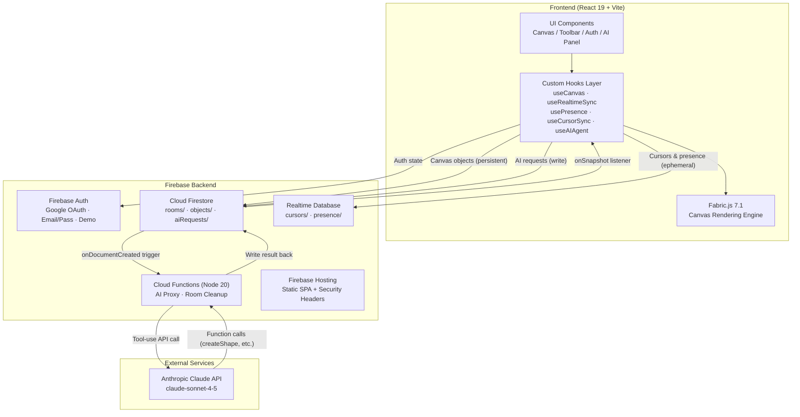
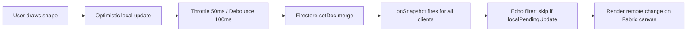
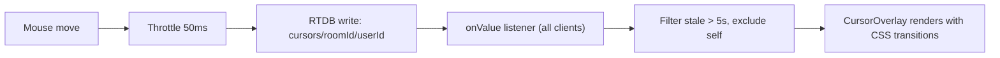

# Architecture Design Record — Collaborative Canvas

---

## 1. System Architecture Diagrams

### High-Level System Flow



### Real-Time Object Sync Flow



### Cursor Sync Flow



---

## 2. Tech Stack

| Layer | Technology | Version |
|---|---|---|
| Framework | React + TypeScript | 19.2 / 5.9 |
| Build | Vite | 7.2 |
| Styling | Tailwind CSS | 4.1 |
| Canvas | Fabric.js | 7.1 |
| Backend | Firebase (Auth, Firestore, RTDB, Functions, Hosting) | 12.8 |
| AI (Primary) | Anthropic Claude API (via Cloud Functions) | claude-sonnet-4-5 |
| AI (Alt) | Google Generative AI (Gemini) | 0.24 |
| Routing | React Router DOM | 7.13 |
| IDs | uuid | 13.0 |
| Testing | Vitest | 3.2 |
| Linting | ESLint + TypeScript ESLint | 9.39 / 8.46 |

---

## 3. Project Structure

```
collaborative-canvas/
├── src/
│   ├── main.tsx                          # React DOM entry point
│   ├── App.tsx                           # Router, AuthProvider, route guards
│   ├── index.css                         # Tailwind imports + global styles
│   │
│   ├── types/
│   │   ├── canvas.ts                     # CanvasObject, ShapeType, Tool, Room, CursorState
│   │   ├── user.ts                       # User, PresenceData
│   │   ├── ai.ts                         # AITool, AIMessage, AICommandResult
│   │   └── index.ts                      # Re-exports
│   │
│   ├── utils/
│   │   ├── colors.ts                     # USER_COLORS palette, SHAPE_COLORS, color selection
│   │   ├── throttle.ts                   # throttle() and debounce() with flush()
│   │   ├── index.ts                      # Re-exports
│   │   ├── colors.test.ts               # Color utility tests
│   │   └── throttle.test.ts             # Throttle/debounce tests
│   │
│   ├── services/
│   │   ├── firebase.ts                   # Firebase app init, config, service exports
│   │   ├── canvasSync.ts                 # Firestore CRUD for canvas objects
│   │   ├── cursorSync.ts                 # RTDB cursor position syncing
│   │   ├── presenceSync.ts              # RTDB online presence management
│   │   ├── aiService.ts                  # AI_TOOLS definitions, action parsing/execution
│   │   ├── geminiService.ts              # Gemini API wrapper for AI commands
│   │   ├── aiService.test.ts            # AI action execution tests
│   │   └── index.ts                      # Re-exports
│   │
│   ├── hooks/
│   │   ├── useAuth.tsx                   # AuthContext provider, auth state management
│   │   ├── useCanvas.ts                  # Fabric.js initialization, zoom, pan, grid
│   │   ├── useRealtimeSync.ts           # Canvas object sync (Firestore/BroadcastChannel)
│   │   ├── usePresence.ts               # Online user presence tracking
│   │   ├── useCursorSync.ts             # Remote cursor broadcasting
│   │   ├── useAIAgent.ts                # AI command processing pipeline
│   │   └── index.ts                      # Re-exports
│   │
│   ├── components/
│   │   ├── Auth/
│   │   │   ├── LoginForm.tsx            # Email/password, Google, demo login UI
│   │   │   ├── UserAvatar.tsx           # User avatar with initials/photo + color
│   │   │   └── index.ts
│   │   ├── Canvas/
│   │   │   ├── Canvas.tsx               # Core drawing engine (~1700 lines)
│   │   │   ├── CanvasToolbar.tsx        # Tool buttons, color pickers, zoom controls
│   │   │   ├── CursorOverlay.tsx        # Remote cursor rendering with labels
│   │   │   └── index.ts
│   │   ├── Presence/
│   │   │   ├── OnlineUsers.tsx          # Online user list with editing status
│   │   │   └── index.ts
│   │   ├── AI/
│   │   │   ├── AICommandInput.tsx       # Floating AI chat panel + input
│   │   │   └── index.ts
│   │   └── Layout/
│   │       ├── Home.tsx                 # Room lobby: create/join interface
│   │       ├── Room.tsx                 # Workspace: orchestrates hooks/components
│   │       └── index.ts
│   │
│   ├── test/
│   │   └── setup.ts                     # Test environment setup
│   │
│   └── assets/
│       └── react.svg
│
├── functions/                            # Cloud Functions backend
│   └── src/
│       └── index.ts                     # AI proxy + room cleanup functions
│
├── Configuration:
│   ├── vite.config.ts                   # Vite build (React plugin, Tailwind, Vitest)
│   ├── tsconfig.app.json               # TS strict mode, ES2022 target
│   ├── eslint.config.js                # ESLint + React hooks rules
│   ├── firebase.json                   # Firestore, RTDB, Functions, Hosting config
│   ├── firestore.rules                 # Firestore security rules
│   ├── database.rules.json            # Realtime Database security rules
│   ├── firestore.indexes.json         # Firestore index definitions
│   └── .env.local                      # Firebase credentials (not committed)
```

---

## 4. Frontend Rationale

### State Management: Hooks-per-Domain (no Redux/Zustand)

**Choice:** Each custom hook owns one domain of state — `useAuth` for auth, `useRealtimeSync` for canvas objects, `useCursorSync` for cursors, `usePresence` for online users, `useAIAgent` for AI chat. `Room.tsx` wires them together.

| State Domain | Storage | Location |
|---|---|---|
| Auth | React Context | `useAuth()` context provider |
| Canvas Objects | `Map<id, CanvasObject>` | `useRealtimeSync()` state |
| Fabric.js Instance | useRef | `useCanvas()` hook ref |
| Cursor Positions | `Map<userId, CursorState>` | `useCursorSync()` state |
| Presence (online users) | `PresenceData[]` | `usePresence()` state |
| Undo/Redo History | useRef `HistoryEntry[]` | `Canvas.tsx` component ref |
| AI Messages | `AIMessage[]` | `useAIAgent()` state |
| UI State (tools, colors, zoom) | Local state | `useCanvas()` state |

**Why this over Redux/Zustand:**
- The domains are **naturally isolated** — cursor state never needs to read auth state, presence never reads canvas objects. Cross-cutting concerns are minimal.
- Firebase listeners already act as the "single source of truth." Adding a client-side store on top would create a **dual-source-of-truth problem** where you'd need to keep Firestore and Redux in sync.
- The app has ~6 state domains with clear ownership. Redux becomes valuable at ~15+ domains with heavy cross-domain reads. This app doesn't hit that threshold.

**Trade-off:** `Room.tsx` becomes a wiring hub (~200 lines of prop-passing). If the number of hooks doubled, this orchestrator would become unwieldy and a state library would become justified.

### Component Structure: Feature-Based Folders

**Choice:** `components/Auth/`, `components/Canvas/`, `components/Presence/`, `components/AI/`, `components/Layout/` — each folder owns its UI.

**Why:** Matches the hook domains 1:1. A developer working on cursors touches `useCursorSync` + `CursorOverlay` — no file-hunting across a flat directory. The Canvas component is large (~1700 lines) because it manages the full Fabric.js lifecycle, drawing, selection, undo/redo, and remote sync rendering in one place.

### Component Hierarchy

```
App.tsx (Router + AuthProvider)
├── LoginForm.tsx (unauthenticated)
├── Home.tsx (room lobby)
│   └── UserAvatar.tsx
└── Room.tsx (workspace orchestrator)
    ├── Canvas.tsx
    │   ├── CanvasToolbar.tsx
    │   └── CursorOverlay.tsx
    ├── OnlineUsers.tsx
    │   └── UserAvatar.tsx (per user)
    └── AICommandInput.tsx
```

### Real-Time Sync: Firebase Listeners (not WebSockets)

**Choice:** Firestore `onSnapshot` for persistent data, Realtime Database `onValue` for ephemeral data. No raw WebSocket server.

**Why this over a custom WebSocket server:**
- **Zero server management.** Firebase handles connection lifecycle, reconnection, offline queuing, and scaling automatically.
- **Built-in persistence.** Firestore snapshots are both the real-time channel AND the database. A WebSocket server would need a separate persistence layer.
- **Conflict resolution for free.** Firestore's `setDoc({ merge: true })` provides last-write-wins without building a custom CRDT or OT system.

**Why split Firestore + RTDB:**
- Canvas objects need **persistence and querying** → Firestore (document model, offline cache, security rules).
- Cursor positions are **high-frequency, ephemeral, disposable** → RTDB (lower latency, cheaper writes, auto-cleanup on disconnect via `onDisconnect()`).

**Trade-off:** Last-write-wins means if two users resize the same shape simultaneously, one update is lost. For a whiteboard this is acceptable — shapes are quick to re-adjust. For a document editor, this would require OT/CRDT.

### Demo Mode: BroadcastChannel Fallback

**Choice:** When Firebase is unconfigured, the app uses the browser's `BroadcastChannel` API for cross-tab sync.

**Why:** Enables local development and demos without any backend setup. A developer can `npm run dev` and open two tabs to test collaboration instantly. The same hook interfaces are used, so the code paths are identical — only the transport layer changes.

| Feature | Firebase Mode | Demo Mode |
|---|---|---|
| Object sync | Firestore snapshot listeners | BroadcastChannel `canvas-room-{id}` |
| Cursor sync | RTDB listeners + onDisconnect | BroadcastChannel `canvas-cursors-{id}` |
| Presence | RTDB listeners + onDisconnect | BroadcastChannel `canvas-presence-{id}` + heartbeat |
| Auth | Firebase Auth (Google/email) | Local demo user object |
| Disconnect | Firebase onDisconnect handlers | Heartbeat timeout (6s) |

### Routing

```
/login         → LoginForm (public, redirects to / if authenticated)
/              → Home (protected) — room lobby
/room/:roomId  → Room (protected) — canvas workspace
*              → redirect to /
```

`ProtectedRoute` wrapper checks `useAuth()` — redirects to `/login` if no user.

---

## 5. Backend Rationale

### API Design: No REST/GraphQL — Firestore as the API

**Choice:** There is no traditional API server. The client reads/writes Firestore documents directly. Cloud Functions are triggered reactively (not called via HTTP).

**Why:**
- For real-time collaborative data, a request-response API adds unnecessary latency. Firestore's listener model means clients get updates **pushed** to them within ~100-300ms.
- Security is enforced via **Firestore Security Rules** (declarative, per-document ACLs) rather than middleware. Rules validate that: only room members can write objects, users can only modify their own presence, AI requests are scoped to members.
- The only server-side logic needed is the AI proxy (to keep the Anthropic API key secret) and room cleanup (cascade-delete subcollections). These are event-triggered Cloud Functions, not REST endpoints.

**Trade-off:** Complex business logic is harder to express in Firestore Security Rules than in server middleware. If the app needed multi-step transactions (e.g., "move object only if user has edit permission AND object isn't locked"), a server API would be cleaner.

### Database Schema

#### Firestore

```
rooms/{roomId}
  ├── id: string
  ├── name: string
  ├── createdBy: string (uid)
  ├── createdAt: Timestamp
  ├── members: string[] (uids)
  └── isPublic?: boolean

rooms/{roomId}/objects/{objectId}
  ├── id: string
  ├── type: ShapeType ('rect'|'circle'|'line'|'triangle'|'star'|'hexagon'|'sticky'|'textbox')
  ├── props: CanvasObjectProps
  │     ├── left, top: number
  │     ├── width?, height?, radius?: number
  │     ├── fill?, stroke?: string
  │     ├── strokeWidth?: number
  │     ├── angle?, scaleX?, scaleY?: number
  │     ├── text?, fontSize?, fontFamily?, textColor?: string
  │     └── x1?, y1?, x2?, y2?: number (line endpoints)
  ├── zIndex: number
  ├── createdBy / updatedBy: string (uid)
  └── createdAt / updatedAt: Timestamp

rooms/{roomId}/aiRequests/{requestId}
  ├── command: string (≤500 chars)
  ├── canvasObjects: CanvasObject[] (summary)
  ├── viewportCenter: {x, y}
  ├── userId: string
  ├── status: 'pending' | 'processing' | 'completed' | 'error'
  ├── createdAt: Timestamp
  ├── result?: { functionCalls: [...], text: string }
  ├── error?: string
  └── completedAt?: Timestamp
```

#### Realtime Database

```
cursors/{roomId}/{userId}
  ├── x, y: number
  ├── userId, userName, color: string
  ├── lastActive: number (Date.now())
  ├── selectedObjectId?: string
  └── isMoving?: boolean

presence/{roomId}/{userId}
  ├── userId, userName, color: string
  ├── online: boolean
  └── lastSeen: ServerTimestamp
```

**Why subcollections for objects?** Each object is a separate document so individual updates don't rewrite the entire room state. Write costs stay proportional to change size. A single `onSnapshot` subscription gets all objects for a room.

**Why AI requests as documents?** Client writes a request → Cloud Function triggers → writes result back → client's `onSnapshot` picks it up. Reuses the existing real-time pipeline with no separate HTTP endpoint, CORS config, or polling logic.

### Auth & Data Validation

**Authentication strategies:**
1. **Google OAuth 2.0** — via Firebase Auth popup
2. **Email/Password** — traditional auth with `createUserWithEmailAndPassword`
3. **Demo Mode** — no authentication, temporary user via `signInAsDemo(name)`

User color is assigned randomly on first login and persisted in `localStorage` (`user_color_{uid}`).

**Validation layers:**
1. **Firestore Security Rules** — structural validation (field types, required fields, member-only writes)
2. **Cloud Function validation** — AI requests: command length ≤500 chars, rate limit 10 req/min/user, object ID pattern validation
3. **Client-side** — TypeScript types at compile time; runtime checks on drawing (min 5px size, origin normalization)

### Cloud Functions

**AI Proxy (`onDocumentCreated` on `rooms/{roomId}/aiRequests/{requestId}`):**
1. Idempotency guard: skip if status != 'pending'
2. Validate command length, rate limit, sanitize object IDs
3. Call Anthropic Claude API with 7 tool definitions (createShape, moveObject, resizeObject, rotateObject, deleteObject, arrangeObjects, createLoginForm, createNavigationBar)
4. Parse tool_use response blocks, write result back to Firestore
5. 30s timeout via AbortController

**Room Cleanup (`onDocumentDeleted` on `rooms/{roomId}`):**
- Cascade-delete subcollections (objects, aiRequests) in batches of 100

---

## 6. Data Flow Details

### Drawing an Object

```
1. User selects shape tool (toolbar)
2. mousedown  → create temporary Fabric object at pointer
3. mousemove  → resize via drag
4. mouseup    → finalize:
   a. Validate min 5px size (sticky notes always valid)
   b. Normalize origin to top-left via getTopLeftPosition()
   c. Generate UUID
   d. onObjectCreated(id, type, props, zIndex) → Room
   e. Add HistoryEntry (type: 'create')
   f. Auto-select, switch to select tool
5. Room → useRealtimeSync.createObject()
   a. Optimistic: update local Map<id, CanvasObject> immediately
   b. Async: syncObject() writes to Firestore
   c. Track in localPendingUpdates to ignore echo
6. Remote users → subscribeToObjects() fires
   → Canvas receives remoteObjects → creates Fabric objects
```

### Object Modification

```
1. mousedown → capture initial props (beforeModifyRef)
2. object:moving/scaling/rotating → throttled (50ms)
   → onObjectModified(id, props)
   → useRealtimeSync.updateObject() debounced (100ms)
3. object:modified → compare with initial props
   → Add HistoryEntry (type: 'modify') if changed
   → Final sync call
```

### AI Command Processing

```
User types "create 3 red circles at center"
  → useAIAgent.processCommand()
  → startHistoryBatch()
  → Cloud Function path: write aiRequest doc → Claude API → result doc
     OR local fallback: regex parser extracts count, color, shape, position
  → Execute actions (createObject calls with offset positions)
  → endHistoryBatch() → single batch HistoryEntry
  → Single Ctrl+Z undoes all created objects
```

---

## 7. Canvas Engine (Fabric.js)

- **Virtual size:** Infinite (unbounded in all directions)
- **Zoom range:** 0.1x – 5x (mousewheel zooms toward pointer)
- **Grid:** Dynamic 50px lines, viewport-only rendering
- **Pan:** Space+drag, middle mouse, or pan tool

### Shape Support

| Shape | Fabric Type | Notes |
|---|---|---|
| rect | Rect | Standard rectangle |
| circle | Circle | Uses radius prop |
| line | Line | x1/y1/x2/y2 endpoints |
| triangle | Triangle | Standard triangle |
| hexagon | Polygon | 6-point generated polygon |
| star | Polygon | 10-point generated star |
| sticky | Textbox | 200x200 yellow note with editable text |
| textbox | Textbox | Free-form editable text |

### Interaction Modes

| Mode | Cursor | Behavior |
|---|---|---|
| Select | Default/move | Click to select, drag to move, handles to scale/rotate |
| Drawing tools | Crosshair | Click-drag to draw, disables selection |
| Pan | Grab | Click-drag to pan viewport |
| Eraser | Crosshair | Click objects to delete |
| Spacebar+drag | Grab | Temporary pan, returns to previous tool |

### History / Undo System

```
HistoryEntry =
  | { type: 'create',  objectId, objectType, props, zIndex }
  | { type: 'delete',  objectId, objectType, props, zIndex }
  | { type: 'modify',  objectId, previousProps, newProps }
  | { type: 'batch',   entries: HistoryEntry[] }
```

- **Max depth:** 50 entries (FIFO eviction)
- **Redo:** Cleared on any new action
- **Batch:** AI operations group multiple creates into one undoable action
- **Ctrl+Z / Cmd+Z:** Undo. **Ctrl+Shift+Z / Cmd+Shift+Z:** Redo.

| Entry Type | Undo Action |
|---|---|
| create | Delete the object |
| delete | Recreate the object |
| modify | Restore previousProps |
| batch | Undo each sub-entry in reverse order |

### Text Editing & Persistence

- `textBufferRef` Map captures text before sync updates, restores it after remote recreation
- `editingTextboxRef` tracks the active Textbox to prevent sync from overwriting mid-edit
- Color changes are skipped during active text editing

### Remote Object Highlighting

- Other users' selected objects: 4px colored stroke in that user's color
- Username badge overlay above the object
- Original stroke saved and restored when remote user deselects
- Highlights hidden during drag (object marked as moving)

---

## 8. Performance Optimizations

| Optimization | Detail |
|---|---|
| Cursor throttle | 50ms (max 20 updates/sec) |
| Object sync debounce | 100ms |
| Object drag broadcast | 50ms throttle |
| Echo prevention | Skip processing own Firestore updates via `localPendingUpdates` |
| Optimistic UI | Local state updates before server round-trip |
| rAF cursor rendering | CursorOverlay uses `requestAnimationFrame` |
| History cap | Max 50 undo entries |
| Stale cleanup | Interval-based removal of inactive cursors (>5s) and presence (>8s) |
| Viewport-only grid | Grid lines drawn only within visible area |
| Partial sync | `syncObjectPartial()` for position-only updates during drag |

---

## 9. Security

- **Firestore Security Rules:** Members-only CRUD on objects; users can only join rooms (not remove others); AI requests scoped to members; only Cloud Functions can write AI results
- **RTDB Security Rules:** Authenticated read for all room data; users can only write their own cursor/presence; data structure validation
- **Cloud Function validation:** Command length limits, rate limiting, input sanitization
- **Firebase Hosting headers:** `X-Frame-Options: DENY`, `X-Content-Type-Options: nosniff`, `Referrer-Policy: strict-origin-when-cross-origin`, `Permissions-Policy: camera=(), microphone=(), geolocation=()`
- **No secrets in client:** Firebase config is public keys only; Anthropic API key stays in Cloud Functions environment
- **Display name sanitization:** Character filtering to prevent XSS

---

## 10. The "Why" Behind the "How" — Trade-Off Register

| Decision | Chosen For | Accepted Cost |
|---|---|---|
| **Last-write-wins sync** | Simplicity — no CRDT/OT library, no version vectors | Concurrent edits on the same object: one user's change is silently lost |
| **Firestore for objects, RTDB for cursors** | Right tool for each job — persistence vs. low-latency ephemeral | Two Firebase services to configure, two subscription patterns to maintain |
| **No external state library** | Fewer dependencies, simpler mental model, Firebase IS the store | `Room.tsx` is a wiring-heavy orchestrator; hook inter-dependencies are implicit |
| **1700-line Canvas component** | All Fabric.js logic co-located — drawing, sync, undo, selection in one place | File is large; extracting sub-hooks would require careful ref-sharing |
| **Cloud Function AI proxy** | API key stays server-side; rate limiting enforced server-side | Cold start latency (~2-5s first call); Firestore round-trip adds ~500ms vs direct HTTP |
| **Demo mode via BroadcastChannel** | Zero-config local dev; same code paths as production | Only works cross-tab on same browser; no true multi-device demo |
| **Ref-based undo history (max 50)** | No re-renders on history changes; fast push/pop | History is lost on page refresh; not synced across users |
| **Throttle cursors at 50ms** | Reduces RTDB writes from ~60/s to ~20/s per user | Cursor positions appear slightly less smooth remotely |
| **AI via Firestore document trigger** | Reuses existing real-time pipeline; no HTTP endpoint needed | Extra Firestore reads/writes; polling-like UX (write → wait → read result) |
| **Tailwind CSS (utility-first)** | Rapid prototyping, no CSS file management, consistent spacing | Large class strings in JSX; harder to scan component structure visually |

---

## 11. Tech Debt & Scaling Concerns

### High Priority

**1. Canvas.tsx is 1700+ lines**
The core Canvas component handles drawing, selection, undo/redo, remote sync rendering, text editing, color management, and context menus all in one file. This makes it difficult to reason about, test in isolation, or modify one concern without risk to others. Extracting `useDrawing`, `useUndoRedo`, and `useRemoteHighlights` hooks would reduce cognitive load.

**2. No offline support / conflict resolution**
Firestore has offline caching, but the app doesn't handle the reconnection case gracefully. If two users edit while one is offline, reconnection produces silent overwrites (last-write-wins). At scale, this will cause user frustration. A lightweight vector clock or operation log would allow merge-on-reconnect.

**3. Undo history is local and volatile**
History lives in a `useRef` array (max 50 entries), lost on refresh, and not shared between users. User A creating a shape and User B pressing Ctrl+Z won't undo A's action — only B's own actions. For a collaborative tool, shared undo (or per-user undo with visibility) is expected.

### Medium Priority

**4. No pagination on canvas objects**
`subscribeToObjects()` loads ALL objects in a room via a single `onSnapshot`. A room with 1000+ objects will cause: large initial download, expensive snapshot diffs, slow Fabric.js rendering. Solution: viewport-based loading or object archiving for off-screen elements.

**5. AI rate limiting is per-function-invocation, not centralized**
Rate limits are checked by reading recent AI request documents (query last 1 minute). Under high concurrency, two requests could pass the check simultaneously before either is written. A Firestore transaction or distributed counter would be more reliable.

**6. No test coverage on Canvas.tsx**
Tests exist for utilities (`colors.test.ts`, `throttle.test.ts`) and AI action parsing (`aiService.test.ts`), but the 1700-line Canvas component — the heart of the app — has zero tests. Integration tests with a mock Fabric.js canvas would catch regressions in drawing, sync, and undo.

### Lower Priority

**7. Cursor cleanup relies on client-side staleness checks**
Stale cursors (>5s without update) are filtered on the client, but the RTDB entries remain. Rooms with many transient users accumulate orphaned cursor entries. A Cloud Function on a schedule (or RTDB TTL rules) would clean these up.

**8. Room membership is append-only**
The Firestore security rules allow users to add themselves to `members[]` but not remove others. There's no mechanism for room owners to kick users or for users to leave rooms. The `members` array will grow unboundedly.

**9. Single-bundle build (~1MB)**
The entire app ships as one JS chunk (~1,077 KB). Fabric.js alone is a large dependency. Route-based code splitting (`React.lazy` for Room vs. Home vs. Login) and dynamic import of Fabric.js only on the Room route would cut initial load significantly.

**10. Hardcoded AI model and token limits**
The Cloud Function uses `claude-sonnet-4-5-20250929` and `max_tokens: 1024` as constants. These should be environment variables or Firestore config documents so they can be updated without redeploying the function.
